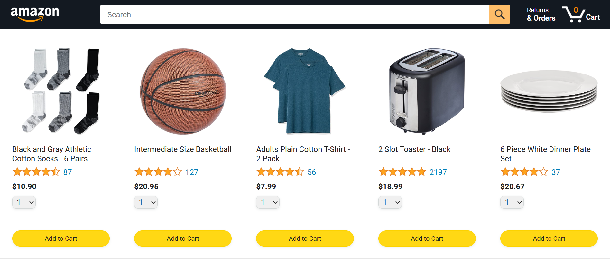
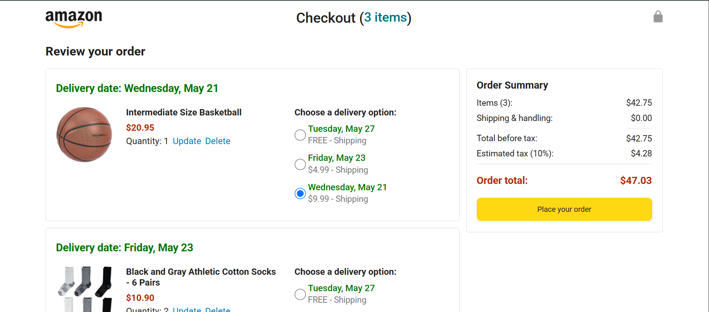

# Amazon Clone

This is a **responsive Amazon Clone web application** built by following the **22-hour JavaScript Tutorial Full Course - Beginner to Pro** by **SuperSimpleDev** on **YouTube**.

The goal of this project is to strengthen my web development skills by applying HTML, CSS, and JavaScript to recreate the core features of Amazon’s front-end shopping experience.

## Features

- Product listing with images, names, prices, and ratings

- Add to cart functionality

- Shopping cart with quantity updates and price calculation

- Checkout summary and simulated order confirmation

- Responsive layout for mobile and desktop

## Technologies Used

- HTML5

- CSS3

- Vanilla JavaScript (ES6+)

- LocalStorage (for persisting cart data)

## Screenshot



<sub>Sample interface showing product listings and shopping cart.</sub>

## Project Status

Still in progress — following the tutorial step-by-step

## Getting Started

1. Clone this repository

```bash
git clone https://github.com/shina-wq/amazon-clone.git
```

2. Open `index.html` in your browser
   <br><sub>No installation needed — it's a front-end-only project.<sub><br>

## What I’m Learning

- DOM manipulation and event handling

- JavaScript modules and structure

- Responsive web design principles

- Simulating e-commerce logic with JS

## Tutorial Credit

Built by following:
<br>[JavaScript Tutorial Full Course - Beginner to Pro](https://www.youtube.com/watch?v=EerdGm-ehJQ&t=55736s)<br>
By: **SuperSimpleDev**
