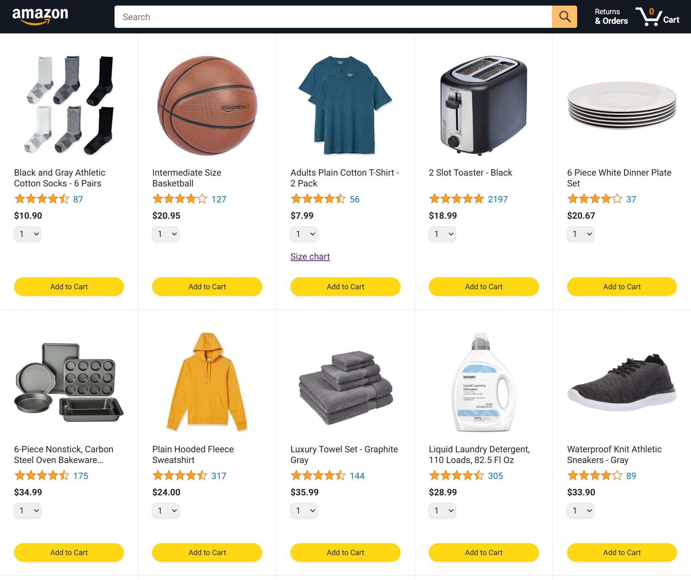
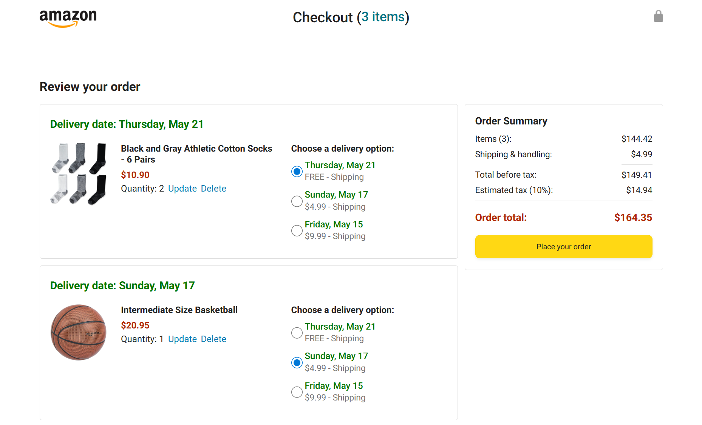

# Amazon Clone

A simple Amazon clone website built with HTML, CSS, and JavaScript.

This project was created by following a tutorial from the [SuperSimpleDev YouTube channel](https://www.youtube.com/watch?v=EerdGm-ehJQ).

## Screenshots

## Tech Stack

- HTML
- CSS
- JavaScript

## Pages

- Home
- Checkout
- Orders
- Tracking
